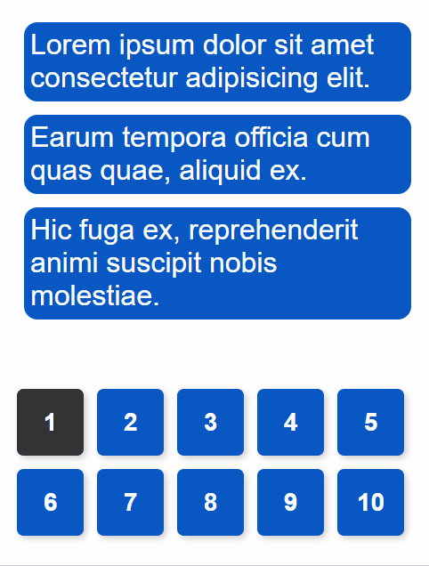

# `@lahav/auto-pagination` - React Component for Auto Pagination of Components

## Made with ❤ by Segev Lahav & Bar Yochai Bokovza

## How to Install?

```sh
# NPM Installation
$ npm i @lahav/auto-pagination

# YARN Installation
$ yarn add @lahav/auto-pagination
```

## Introduction

One of the most intresting cases that we have in our project, is **to enable items in a list to position themselve**, for a dynamic paging.



We've create a component name `<Pagination>`, which enables you to put your list of items, and dynamically assign them items, so they will take as little pages as possible, without breaking them.

In order for the component to work properly, you need to wrap the component with a `<div>` (It can be even `<Box>` or `<Grid>` from `@mui`, or any `styled` div), that will define the size of the area that the component will take place.

[How to use the component?](https://github.com/bar-boko/auto-pagination/blob/main/src/Pagination.stories.tsx)
Note: In the given example, the name of the component is

## Props

- `children`: Like every React's Wrapper Components
- `page`: The current page that is visible for the users.
  - Range of values between [`0`, `amount of pages`)
- `onPagesChange`: A function that we'll fired up in every change in the amount of pages. The value in this function is useful for Paginators.
  - Default value is `1`
- `transitionDuration` & `transitionTimingFunction`: If you want adding a transition between pages, the same `CSS` values are applied in these props.
  - Default `transitionTimizingFunction`: `ease-in-out`
- `rtl`: in case you would like to change the pagination direction to the right

## Support Us

If you loved and you're using our small component, please give us a thumb, we've worked hard about that case.

- [Segev Lahav](https://www.buymeacoffee.com/lahavsegev)
- [Bar Yochai Bokovza](https://www.buymeacoffee.com/barboko)
